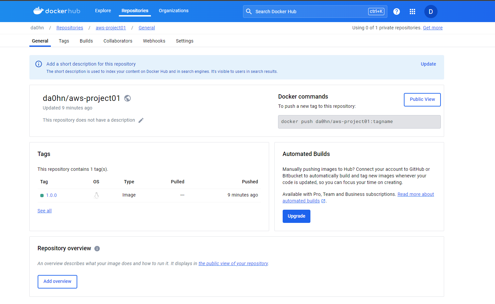

# Projeto 01

Para realizar o build da api é necessário utilizar o java na versão 17, após instalado a variável de ambiente JAVA_HOME deve ser configurada. Caso 
esteja no windows (pwsh) utilize o comando abaixo para configurar a variável de ambiente.

```shell
$ $env:JAVA_HOME = "PATH-TO-JAVA-17-FOLDER"
```

Para realizar o build da aplicação utilize o comando abaixo.

```shell
$ ./gradlew build
```

Para gerar enviar uma imagem para o docker hub é necessário estar autenticado localmente no docker desktop (windows).

```shell
$ ./gradlew dockerPush1.0.0
```

Após isso será possivel visualizar a imagem no docker hub.


